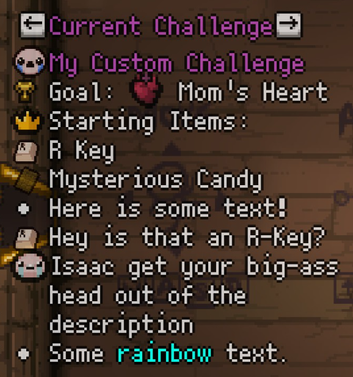

# Tutorial - Adding a Challenge Description

First, we add a callback, which will execute

```lua
function mod:onChallengeAPILoad()
    print("Ready to load challenge data!")
end

mod:AddCallback("CHALLENGEAPI_POST_LOADED", mod:onChallengeAPILoad)
```

This registers a function to be called by the custom ModCallback provided by ChallengeAPI. This ensures your data is always registered correctly; using `ModCallbacks.MC_POST_MODS_LOADED` might run your callback before ChallengeAPI is ready.

Next, we have to retrieve our challenge object to modify it.

```lua
-- Get the internal numeric ID for the challenge.
local challengeID = Isaac.GetChallengeIdByName("My Custom Challenge")

-- Retrieve the challenge object from ChallengeAPI.
local challenge = ChallengeAPI:GetOrRegisterChallenge(challengeID, "My Custom Challenge", PlayerType.PLAYER_ISAAC, "moms-heart")

-- Provide additional info for the challenge.
-- This code is redundant if REPENTOGON is installed.
if not REPENTOGON then
    -- Specify the starting collectibles. This only affects EID.
    challenge:SetStartingCollectibles({
        CollectibleType.COLLECTIBLE_R_KEY,
    })
    challenge:SetStartingTrinkets({ TrinketType.TRINKET_PETRIFIED_POOP })
    challenge:SetRoomFilter({ RoomType.ROOM_TREASURE })
end
```

Note the additional parameters we provide here. If the user does not have REPENTOGON installed, ChallengeAPI can't retrieve the information from the `challenge.xml` file automatically, and you'll have to provide it manually. If you're certain that your mod is utilizing the REPENTOGON script extender, you can simply use `ChallengeAPI:GetChallengeById(challengeId)`.

Once this is done, you can provide additional descriptions for EID. This obviously works with or without REPENTOGON.

```lua
-- Provide additional info for the challenge, as a table of strings, each representing one line.
-- You can use markup to add icons, change text color, and more. See the EID documentation for more info:
-- https://github.com/wofsauge/External-Item-Descriptions/wiki/Markup
challenge:SetEIDNotes({
    "Here is some text!",
    "{{Collectible636}} Hey is that an R-Key?",
    "{{Isaac}} Isaac get your big-ass head out of the description",
    "Some {{ColorRainbow}}rainbow{{ColorReset}} text."
})
```



## Summary

Here's the full example code:

```lua
function mod:onChallengeAPILoad()
    -- Get the internal numeric ID for the challenge.
    local challengeID = Isaac.GetChallengeIdByName("My Custom Challenge")

    -- Retrieve the challenge object from ChallengeAPI.
    local challenge = ChallengeAPI:GetOrRegisterChallenge(challengeID, "My Custom Challenge", PlayerType.PLAYER_ISAAC, "moms-heart")

    -- Provide additional info for the challenge.
    -- This code is redundant if REPENTOGON is installed.
    if not REPENTOGON then
        -- Specify the starting collectibles. This only affects EID.
        challenge:SetStartingCollectibles({
            CollectibleType.COLLECTIBLE_R_KEY,
        })
        challenge:SetStartingTrinkets({ TrinketType.TRINKET_PETRIFIED_POOP })
        challenge:SetRoomFilter({ RoomType.ROOM_TREASURE })
    end

    -- Provide additional info for the challenge, as a table of strings, each representing one line.
    -- You can use markup to add icons, change text color, and more. See the EID documentation for more info:
    -- https://github.com/wofsauge/External-Item-Descriptions/wiki/Markup
    challenge:SetEIDNotes({
        "Here is some text!",
        "{{Collectible636}} Hey is that an R-Key?",
        "{{Isaac}} Isaac get your big-ass head out of the description",
        "Some {{ColorRainbow}}rainbow{{ColorReset}} text."
    })
end

mod:AddCallback("CHALLENGEAPI_POST_LOADED", mod:onChallengeAPILoad)
```